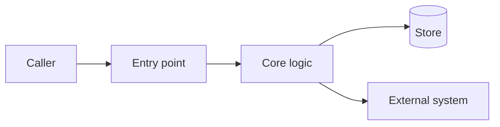
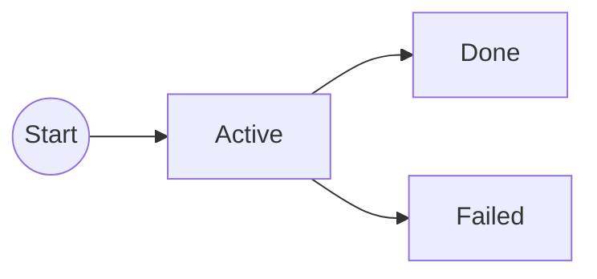

# <Product or Feature> — Architecture

> Companion to [`erd.md`](./erd.md), which owns goals, decisions, contracts, acceptance criteria,
> risks, open questions and slices. This document owns **system shape**. Do not duplicate the pair.
>
> Apply the architecture pattern declared in this repo's `AGENTS.md`. If none is declared, describe
> the structure plainly — the kit mandates no pattern.

## Scope

<What this system does and does not own. One paragraph. No narrative.>

## Mental model

<2–4 sentences: what it is, how work flows through it, the constraint that shapes it.>

## System diagram

Label external systems, data stores, trust boundaries and async paths. One useful diagram beats
several decorative ones — keep it reviewable in a browser.

## Components and boundaries

| Component | Owns | Does not own |
| --- | --- | --- |
|  |  |  |

## Interfaces

<The seams this system exposes and depends on, in whatever form the declared pattern uses —
ports and adapters, modules, packages, contracts. Name the role, not the vendor.>

| Kind | Interface | Role |
| --- | --- | --- |
|  |  |  |

## Primary control flows

### <Flow name>

1.
2.
3.

<One numbered flow per significant path. Include the failure path where it is not obvious.>

## Data ownership

- **Owns / writes:**
- **Reads only:**
- **Never shares:** <credentials, stores, or state that must not be reached around this system>

## State model

| State | Meaning | Who sets it |
| --- | --- | --- |
|  |  |  |

## Deployable boundaries

| Deployable | Responsibility | Talks to |
| --- | --- | --- |
|  |  |  |

## Related systems

-

## References

- Requirements: [`erd.md`](./erd.md)
